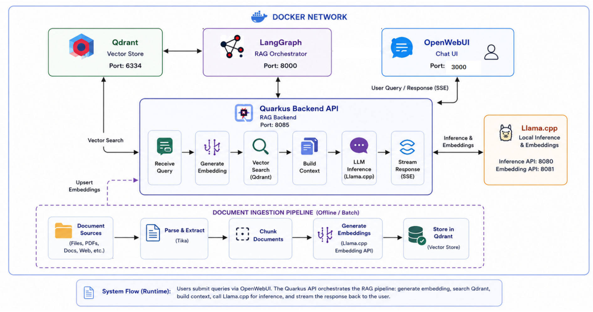

# Minimal RAG System

A containerized Retrieval-Augmented Generation (RAG) system built with Quarkus, Qdrant, and Llama.cpp for intelligent document-based Q&A.

## Architecture Overview



## Quick Start

```bash
docker-compose up -d
```

This starts:
- Qdrant (vector store)
- LangGraph (orchestrator)
- OpenWebUI (chat interface)
- Quarkus API (RAG backend)

You need to launch locally:
- Llama.cpp (embedding & inference)
