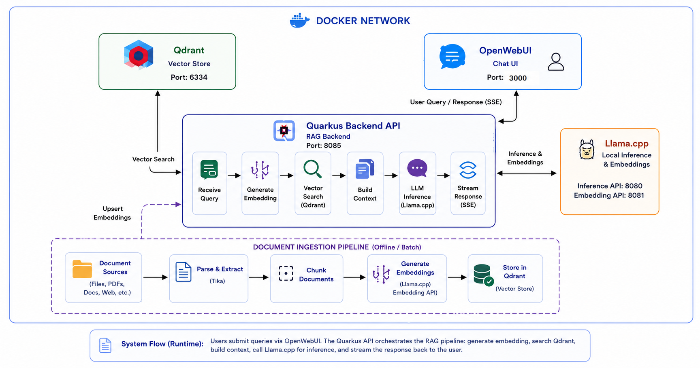

# Naive RAG System

A containerized Retrieval-Augmented Generation (RAG) system built with Quarkus, Qdrant, and Llama.cpp for intelligent document-based Q&A.

## Architecture Overview



- **Quarkus** for the backend orchestration API
- **Qdrant** as the vector database
- **Llama.cpp** for local inference and embeddings
- **OpenWebUI** as the chat frontend
- **Apache Tika** for document parsing

### 1. Clone the Repository

```bash
git clone <repository-url>
cd naive-rag
```

### 2. Configure Environment Variables

```bash
# Copy the example environment file
cp .env.example .env

# Edit the .env file with your configuration
nano .env
```

### 3. Required Configuration

Edit `.env` to configure your own LLM embedding model and inference model URLs. 
(Optional) Modify the ingestion source directory.

### 4. Launch the System

```bash
# Start all containers in detached mode
podman-compose up -d

# Verify all containers are running
podman ps
```

**Expected Output:**
```
CONTAINER ID   IMAGE                              STATUS
abc123456789   qdrant/qdrant:latest              Up 2 minutes
def987654321   registry.access.redhat.com/...    Up 2 minutes
ghi654321098   openwebui/open-webui:main         Up 2 minutes
```

### 5. The Ingest Endpoint

```bash
# Send a request to the ingest endpoint
podman exec -it quarkus-app bash -c 'curl http://localhost:8080/v1/ingest'
```

**Expected Response:**
```json
{
  "status": "success"
}
```

### 6. Verify Vector Embeddings in Qdrant

Open the Qdrant dashboard in your browser:

```
http://localhost:6333/dashboard
```

### 7. Use RAG with OpenWebUI

Access the OpenWebUI chat interface:

```
http://localhost:3000
```

**Features available:**
- 📝 Upload documents directly
- 💬 Chat with your documents
- 🔍 Search across ingested content
- 📊 View conversation history
